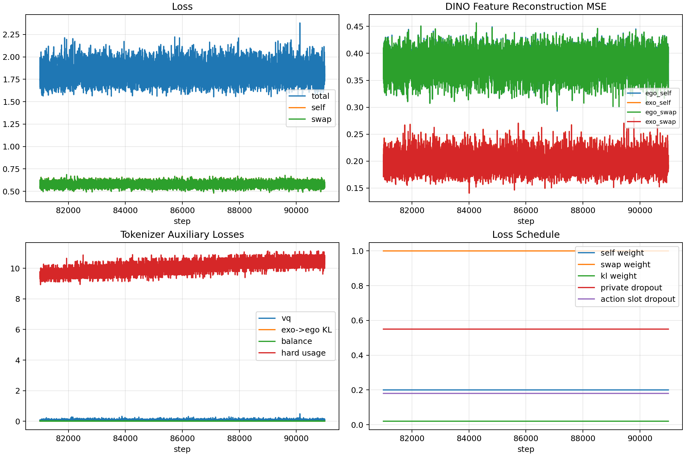
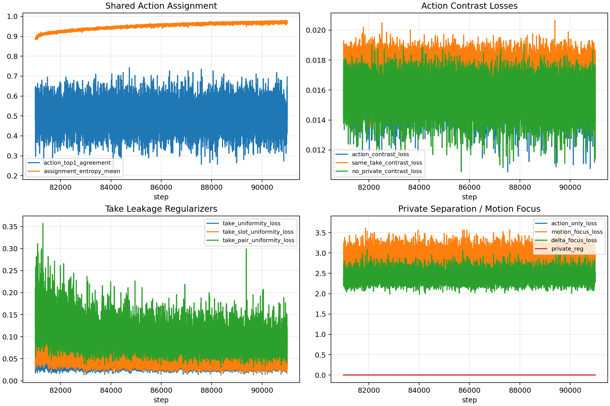
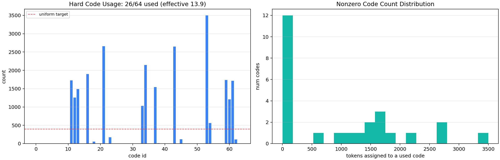
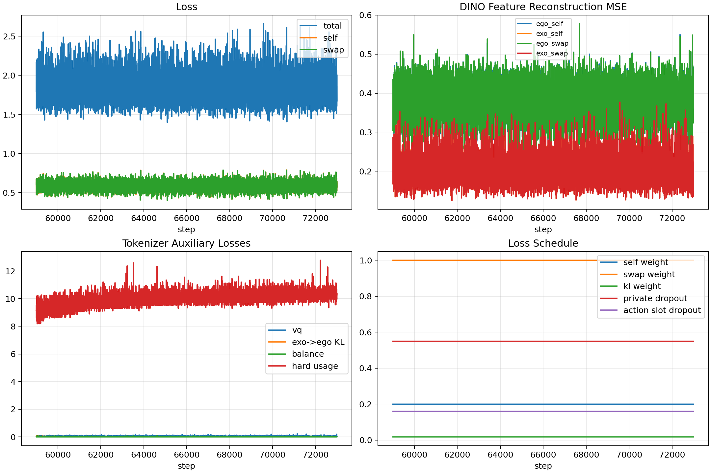
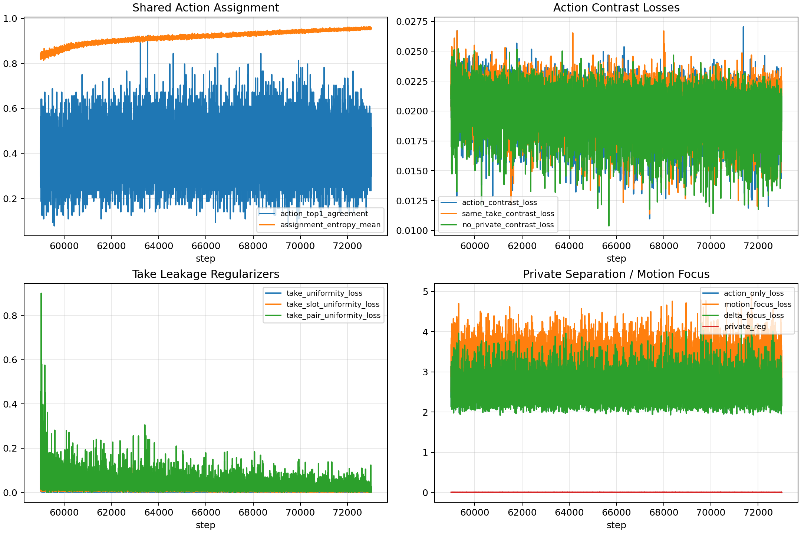
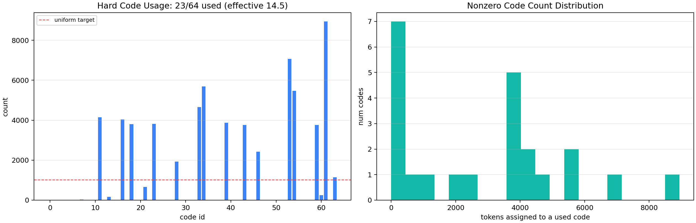

# FACT Tokenizer 当前实验综合结论

更新时间：2026-06-18

本文综合当前 FACT tokenizer MVP 的主要实验，从 debug smoke、500-take 基线、v4/v5 系列 finetune、4.0 非 multi-exo 改进实验，到最新 v5l transition48 训练结果。结论只覆盖当前仓库的一阶段 tokenizer，不扩展到 WAM、Action Head、SONIC 或完整 robot deployment。

## 1. 当前阶段目标

根据 `docs/fact_tokenizer_plan_3_0.md` 和 4.0 方案，一阶段目标不是学习普通 future visual token，而是学习 ego-accessible 的 shared action token：

- Ego/Exo 对同一 transition 应落到相同或相近的 shared action prototype。
- shared action token 应主要表达 interaction dynamics、动作阶段、接触变化，而不是 take、场景、任务背景或视角外观。
- private residual 只作为 tokenizer 训练辅助，用来吸收 view-specific residual，不应成为 WAM label 或后续动作信号。
- 当前阶段先不加入完整 multi-exo teacher 聚合，只使用两视角 Ego/Exo 下的 confidence-gated exo weak teacher、swapped reconstruction、private separation、usage balancing 和 validation gate。

当前阶段 gate 的核心验收标准包括：

- action token causality：替换 action token 后 future reconstruction 应明显变差。
- private separation：不能主要靠 private residual 或 current frame 糊过去。
- view invariance：token 不应明显编码 ego/exo view identity。
- take leakage：token 不应明显编码 take identity。
- codebook health：64-code codebook 中 ego 侧应有效使用约 45-55 个 code。

## 2. 数据与评估设置

当前主实验使用 500 个 diverse EgoExo takes：

- 原始 shard：`data/fact_egoexo/shards/train_diverse_500takes_16t_000000.npz`
- split：`data/fact_egoexo/splits/diverse_500takes_seed123_80_20/`
- take 数：500
- train takes：400
- heldout takes：100
- 总 transition：7999
- train transition：6399
- heldout transition：1600
- 每个 take 基本为 16 个 transition。

重要：train / heldout 已按 take 划分，不是 transition 随机划分。这让 heldout gate 可以检查 token 是否泛化到没见过的 take。

v5l 进一步引入 dense transition48 数据版本：

- transition window：`transition_sec = 0.5`
- transition stride：`stride_sec = 1.0`
- 每个可用 take 严格采样 48 个 transition
- 73 个短 take 被跳过，不做重复 clamp
- full shard：427 takes / 20496 transitions
- train：342 takes / 16416 transitions
- heldout：85 takes / 4080 transitions
- train / heldout 仍按 take 划分。

## 3. 实验路线回顾

### 3.1 工程 smoke / debug 阶段

最早一批实验主要验证工程链路，而不是验证 token 语义：

| run | 数据 | steps | code usage | 作用 |
|---|---|---:|---:|---|
| `env_fact_tokenizer_smoke` / `npz_debug_train` | dummy multiview | 10 | 4/16 | 验证基础训练、保存、导出代码可运行 |
| `egoexo_debug_mock` | small debug NPZ | 10 | 4/16 | 验证 paired NPZ dataset 和 mock backbone |
| `egoexo_debug_dino_smoke` | small Ego/Exo | 3 | 5/16 | 验证 DINO backbone 可接入 |
| `egoexo_debug_dino_3takes_50step` | 3 takes | 50 | 14/16 | 验证 DINO 小规模训练可以下降 |
| `egoexo_debug_dino_10takes_200step` | 10 takes | 200 | 12/16 | 验证 token extraction 和 visualization |
| `egoexo_debug_dino_40takes_500step` | 40 takes | 500 | 15/16 | 验证较大 debug set 可训练 |
| `egoexo_debug_dino_40takes_1000step_b8` | 40 takes | 1000 | 6/16 | 发现长训后小 codebook 也会局部 collapse |
| `egoexo_debug_dino_40takes_1000step_b8_balanced` | 40 takes | 1000 | 7/16 | balance 对小 debug set 帮助有限 |
| `ddp_dino_4gpu_smoke_20260615_165116` | 40 takes | 20 | 37/64 | 验证 DDP + DINO + K=64 可以启动 |

这个阶段的结论：

- NPZ dataloader、paired Ego/Exo 输入、DINO backbone、DDP、多 GPU训练、checkpoint 保存和 token 导出都已经跑通。
- shared codebook 和 private residual 分支可以端到端训练。
- 小规模 debug 中 code usage 波动很大，不能作为 action-token 质量证据。
- 这个阶段只证明工程闭环，不证明 token 已经 action-centric。

### 3.2 v0.1：500-take K64 主基线

主基线 run：

- `egoexo_diverse_500takes_k64_20k_ddp4_resumable_20260615_181053`
- 数据：`train_diverse_500takes_16t_000000.npz`
- steps：20000
- codebook：K=64
- action slots：4
- private slots：1
- backbone：frozen DINOv2
- 训练路径：ego/exo self reconstruction + ego/exo swapped reconstruction

训练侧结果：

- total loss 从早期约 1.53 降到最后约 0.70-0.73。
- self reconstruction 与 swap reconstruction 几乎重合。
- ego token 成功导出，shape 为 `(7999, 1, 4)`。
- private residual 未导出，符合设计。
- code usage：49/64。
- effective codes：17.7。

v0.1 的正面信号：

- 这是第一次完整证明 FACT tokenizer 一阶段工程机制可训练、可保存、可导出、可验证。
- swap reconstruction 接近 self reconstruction，说明另一个视角的 shared token 在重建路径上可替换。
- codebook 没有整体 collapse。

v0.1 的不足：

- reconstruction 成功不等于 action semantics 成立。
- decoder 可能借助 current frame、private residual 或 take/context shortcut 完成重建。
- assignment confidence 偏低，soft distribution 仍较模糊。
- action slot 分工不均匀，部分 slot 有局部 collapse。
- 当时还没有正式 heldout take gate。

因此 v0.1 的定位是：FACT tokenizer MVP 跑通，但需要 causality、private leakage 和 semantic probe。

### 3.3 v1：Enhanced Action Bottleneck

run：

- `egoexo_diverse_500takes_k64_20k_enhanced_action_bottleneck_20260616_163726`

主要改动：

- 加入 private dropout。
- 加入 action-only / no-private reconstruction。
- 加入 shuffled action contrast。
- 补充 private leakage probe。

结果摘要：

- train code usage：27/64。
- effective codes：18.3。
- confidence mean：约 0.0148。
- ego random-take causality delta：约 0.00875 / 0.00964。
- exo random-take causality delta：约 0.00040 / 0.00047。
- view NMI：约 0.1589。
- take NMI：约 0.6176 / 0.6256。

结论：

- action bottleneck 让 ego causality 有所增强。
- private leakage 有一定下降。
- 但 confidence 仍极低，take/task leakage 很高。
- code usage 从 v0.1 的 49/64 降到 27/64，说明 action bottleneck 会带来容量收缩风险。

### 3.4 v2：Exo Balance Finetune

run：

- `egoexo_diverse_500takes_k64_30k_v2_exo_balance_finetune_20260616_174802`

主要改动：

- 从 v1 finetune 到 30k。
- 降低学习率。
- 加强 exo auxiliary loss。
- 增强 action consistency、assignment entropy、motion focus。
- private dropout 提高到约 0.45。

结果摘要：

- train code usage：23/64。
- effective codes：15.1。
- confidence mean：约 0.1953。
- ego random-take causality delta：约 0.0117。
- exo random-take causality delta：约 0.00053 / 0.00065。
- exo zero sensitivity：约 0.0039 / 0.0040。
- ego action saving without private：约 0.017。
- view NMI：0.0481。
- take NMI：0.3732 / 0.4089。
- task NMI：0.2138 / 0.2383。

结论：

- v2 是第一个“比较稳”的增强版本。
- confidence 从 v1 的极低水平提升到 0.1953。
- view leakage 明显下降，take NMI 也从 0.62 降到约 0.37-0.41。
- ego/exo causality 都有提升。
- 但 code usage 只有 23/64，effective codes 约 15，表达容量偏窄。

### 3.5 v3 / v3b：Diversity / Delta From v0

代表 run：

- `egoexo_diverse_500takes_k64_30k_v3b_diversity_delta_from_v0_20260616_193103`

主要改动：

- 从高 usage 的 v0.1 出发，而不是从 v2 出发。
- 加入更强 assignment entropy target、slot balance、delta focus。
- 提高 exo auxiliary multiplier。

结果摘要：

- train code usage：13/64。
- effective codes：7.0。
- confidence mean：约 0.0104。
- ego random-take causality delta：约 0.00754 / 0.00615。
- exo random-take causality delta：约 0.00034 / 0.00042。
- view NMI：0.1071。
- take NMI：0.3970 / 0.4265。

结论：

- 这是一个重要负结果。
- 从高 usage v0.1 出发并不能保住 code diversity。
- 过强 entropy / slot balance / delta 组合会让 soft assignment 更模糊，hard code usage 反而 collapse。
- private 依赖重新变强。
- v3/v3b 不适合作为后续主线。

### 3.6 v4 / v4b / v4c：Hard Usage 修复尝试

相关 run：

- `egoexo_diverse_500takes_k64_40k_v4_hard_usage_from_v2_20260616_201435`
- `egoexo_diverse_500takes_k64_40k_v4b_hard_usage_from_v2_20260616_214233`
- `egoexo_diverse_500takes_k64_40k_v4c_hard_usage_from_v2_20260616_214445`

主要改动：

- 从 v2 出发。
- 加入 ST-hard usage balance。
- 加入 slot diversity loss。
- 尝试在保持 v2 confidence 的同时恢复 hard code usage。

结果与判断：

- v4c 训练早期 assignment entropy 升到约 0.98。
- soft assignment 重新变得极度模糊。
- v4c 提前停止在约 31.6k。
- hard usage balance 权重过强时，会制造“想用更多 code，但 assignment 不确定”的失败模式。
- hard usage loss 只能作为弱正则，不能成为主导目标。

### 3.7 v4d：Gentle Usage From v2

run：

- `egoexo_diverse_500takes_k64_35k_v4d_gentle_usage_from_v2_20260616_215152`

主要改动：

- 从 v2 出发，训练 30k 到 35k。
- 学习率降到 `1.5e-5`。
- VQ temperature 降到 `0.06`。
- VQ beta 提高到 `0.35`。
- entropy penalty 加强。
- hard usage balance 降到极弱。
- slot diversity 降低。
- 移除强 slot balance。
- delta/motion 辅助项保持温和。

训练侧结果：

- train code usage：46/64。
- effective codes：21.4。
- confidence mean：约 0.3458。
- ego random-take causality delta：约 0.0131。
- exo random-take causality delta：约 0.00089。
- exo zero sensitivity：约 0.0055。
- private 去掉后损失变化很小，但 action 置零或替错时损失明显变差。

v4d 是 v4d 之前所有实验里最均衡的模型：

- 相比 v2，confidence、code usage、effective code、ego/exo causality 都提升。
- private residual 没有成为主要动作通道。
- action token 已经有可替换控制变量的迹象。
- 但 take NMI 仍高，且还需要 heldout take gate 验证。

v4d 后续正式 heldout gate 仍失败：

- `ego_swap_random_take_delta = 0.01198 < 0.015`
- `ego_swap_random_code_delta = 0.02361 < 0.025`
- `exo_swap_random_take_delta = 0.00092 < 0.002`
- `exo_swap_zero_delta = 0.00561 < 0.006`
- `tuple_view_nmi = 0.134 > 0.10`
- `tuple_take_nmi = 0.463 > 0.35`
- `ego_used_codes = 41 < 45`

解释：v4d 说明 codebook 可以被打开到一定程度，也比 v0.1/v1/v2/v3 更接近 action token；但在严格 heldout take gate 下，token 还没有足够 action-causal，并存在 take/view leakage。

### 3.8 v5a / v5b：按 take split 后的 smoke 与 scratch 尝试

相关 run：

- `v5a_split_smoke`
- `egoexo_diverse_400train_100heldout_k64_35k_v5a_v4d_recipe_scratch_*`
- `egoexo_diverse_400train_k64_20k_v5b_base_scratch_4gpu_20260617_140443`

作用：

- 验证 train/heldout 按 take 划分后的数据路径。
- 验证 split 后脚本、probe、gate、manifest 能跑通。
- 尝试 scratch 训练是否能复现 v4d 的质量。

结论：

- split 工程路径跑通。
- scratch 路线在当前资源与数据规模下不如从 v4d/v2 继续 finetune 稳定。
- 后续 v5c 之后主线改为从已有较好 checkpoint 做 targeted finetune。

### 3.9 v5c / v5d：action bottleneck 与 slot dropout

v5c 和 v5d 从 v4d 继续做 8-GPU finetune，重点尝试：

- action-only reconstruction
- action contrast
- no-private contrast
- private dropout
- action slot dropout
- motion / delta focused losses

结果：

| run | train code usage | heldout gate | take_nmi | view_nmi | ego_used | 主要失败项 |
|---|---:|---:|---:|---:|---:|---|
| `v5c_v4d_finetune_contrast_8gpu_20260617_181755` | 37/64, effective 20.5 | failed | 0.470 | 0.093 | 34 | ego random-take, exo random-take, private gap, take leakage, usage |
| `v5d_v4d_finetune_slot_dropout_8gpu_20260617_185920` | 38/64, effective 22.2 | failed | 0.429 | 0.070 | 38 | ego/exo causality, ego action saving, take leakage, usage |

结论：

- v5c/v5d 成功把 `tuple_view_nmi` 压到 gate 阈值内，说明 view leakage 被明显改善。
- 但 `tuple_take_nmi` 仍高于 0.35，take identity leakage 没有解决。
- ego/exo action causality 仍不稳定，尤其 exo branch 很弱。
- code usage 没有达到 45-code 下限。

### 3.10 v5e：capacity check

run：

- `v5e_slots2_capacity_check_8gpu_20260617_192203`

作用：

- 快速检查 action slots / capacity 改动方向。
- 该 run 没有形成完整正式结果，也不是后续主线。

结论：

- 当前主要瓶颈不是简单扩大或缩小 slot capacity，而是 take leakage、code usage 和 action causality 的联合问题。

### 3.11 v5f / v5g / v5j / v5k：4.0 非 multi-exo weak teacher 与 anti-take 修复

这一组实验按照 4.0 方案中除完整 multi-exo teacher 聚合以外的内容推进：

- confidence-gated exo prototype alignment
- ego uncertainty / ego-exo disagreement corrective teaching
- stronger private regularization 与 private dropout
- stronger codebook usage balancing
- same-take contrast
- take-grouped batches
- take uniform / slot uniform / pair uniform anti-take losses
- 8 GPU 高利用率训练

结果：

| run | train code usage | heldout gate | take_nmi | view_nmi | ego_used | 主要失败项 |
|---|---:|---:|---:|---:|---:|---|
| `v5f_4p0_teacher_usage_8gpu_20260617_192843` | 36/64, effective 23.7 | failed | 0.433 | 0.062 | 35 | ego/exo causality, ego action saving, take leakage, usage |
| `v5g_4p0_usage_repair_8gpu_20260617_195818` | 37/64, effective 24.5 | failed | 0.523 | 0.083 | 32 | random-code, exo causality, ego action saving, take leakage, usage |
| `v5j_4p0_usage_take_repair_8gpu_20260617_203626` | 32/64, effective 17.2 | failed | 0.466 | 0.087 | 30 | ego/exo causality, ego action saving, take leakage, usage |
| `v5k_4p0_usage_antitake_repair_8gpu_20260617_211752` | 26/64, effective 13.9 | 未跑 heldout gate | - | - | - | train-side code collapse 明显 |

v5k 训练侧最终指标：

- `loss_start = 1.7398`
- `loss_end = 1.8073`
- `ego_self_mse_start = 0.3527`
- `ego_self_mse_end = 0.3373`
- `ego_swap_mse_start = 0.3529`
- `ego_swap_mse_end = 0.3362`
- `action_top1_agreement_end = 0.6953`
- `used_codes = 26/64`
- `effective_codes = 13.90`
- `max_code_fraction = 0.137`

v5k 已自然完成并保存 checkpoint：

- `/data_all/sxh/FACT_tokenizer/outputs/fact_tokenizer/v5k_4p0_usage_antitake_repair_8gpu_20260617_211752/fact_tokenizer.ckpt`

但 v5k 没有跑正式 heldout probe/gate。根据训练侧 `26/64` 和 effective code `13.9`，它大概率无法通过 `ego_used_codes >= 45` gate。

### 3.12 v5l：transition48 dense take repair

run：

- `v5l_transition48_dense_from_v5f_20260618_121935`

主要改动：

- 从 `v5f_4p0_teacher_usage_8gpu_20260617_192843` checkpoint 继续 finetune。
- 数据从旧的约 16 transitions/take 改为 `transition_sec=0.5s, stride_sec=1.0s, 48 transitions/take`。
- train / heldout 按 take 划分，heldout 为 85 个未见 take / 4080 transitions。
- 保留 4.0 非 multi-exo 机制：confidence-gated exo weak teacher、private dropout、no-private contrast、same-take contrast、take uniform 系列正则。
- 8 GPU 训练，per-GPU batch 16，总共从 step 59000 跑到 step 72999。

训练侧结果：

- final checkpoint：`outputs/fact_tokenizer/v5l_transition48_dense_from_v5f_20260618_121935/fact_tokenizer.ckpt`
- final loss：1.6733
- last-1000 loss mean：1.8465
- last-1000 self / swap mean：0.5866 / 0.5871
- final action top1 agreement：0.3438
- train hard code usage：23/64
- train effective codes：14.51
- max code fraction：0.136

heldout gate 结果：

| metric | value | threshold | pass |
|---|---:|---:|---|
| `tuple_view_nmi` | 0.055 | <= 0.10 | yes |
| `tuple_take_nmi` | 0.339 | <= 0.35 | yes |
| `ego_used_codes` | 21 | >= 45 | no |
| `ego_swap_random_take_delta` | 0.0039 | >= 0.015 | no |
| `ego_swap_random_code_delta` | 0.0034 | >= 0.025 | no |
| `ego_swap_same_take_delta` | 0.0029 | >= 0.010 | no |
| `exo_swap_random_take_delta` | 0.0008 | >= 0.002 | no |
| `exo_swap_zero_delta` | 0.0013 | >= 0.006 | no |
| `ego_action_without_private_saving` | 0.0070 | >= 0.018 | no |
| `ego_private_only_gap` | -0.0005 | <= 0.012 | yes |

结论：

- transition48 数据策略是有效的：第一次把 `tuple_take_nmi` 压到 gate 阈值内，同时 `tuple_view_nmi` 继续保持很低。
- 但 v5l 没有成为可冻结 tokenizer：action causality delta 全面偏弱，说明 decoder 对 shared action token 的真实依赖不足。
- code usage 从 v5f 的 36/64 降到 v5l 的 23/64，ego heldout 只有 21 个 code，说明 dense data + 当前 loss 配方把模型推向更保守的少数 prototype。
- v5l 证明了数据采样方向有价值，但也暴露出下一步必须优先修 codebook health 和 action-token causality。

## 4. 综合实验结论

### 4.1 当前尚未通过 Stage-1 gate

截至 v5l，当前 FACT tokenizer 一阶段还没有满足 go / no-go gate。v5l 首次通过 take/view leakage gate，但 action causality 和 ego code usage 明显失败，因此还不能冻结为后续 WAM label tokenizer。

### 4.2 View leakage 已明显改善

从 v5c 开始，`tuple_view_nmi` 基本低于 0.10：

- v5c: 0.093
- v5d: 0.070
- v5f: 0.062
- v5g: 0.083
- v5j: 0.087
- v5l: 0.055

这说明 shared token 已经不主要编码 ego/exo view identity。private residual、slot dropout、contrast 和 4.0 weak teacher 对 view-invariance 是有效的。

### 4.3 Take leakage 被 transition48 首次压到阈值内

v5l 之前的正式 heldout gate 中，`tuple_take_nmi` 都明显高于 0.35：

- v4d: 0.463
- v5c: 0.470
- v5d: 0.429
- v5f: 0.433
- v5g: 0.523
- v5j: 0.466
- v5l: 0.339

v5l 的结果说明，单纯在旧 16 transitions/take split 上堆 loss 很难解决 take leakage；而更 dense 的同 take 动作阶段覆盖能够削弱 take identity 捷径。现在 take leakage 不再是唯一最大瓶颈，主要瓶颈转移到 action causality 和 codebook usage。

### 4.4 Codebook usage 与 anti-take 正则出现冲突

随着 v5g/v5j/v5k 增强 usage repair 和 anti-take regularization，train-side used codes 反而下降：

- v5f: 36/64
- v5g: 37/64
- v5j: 32/64
- v5k: 26/64
- v5l: 23/64

v5l 的 train effective codes 只有 14.51，heldout ego effective codes 约 14.65。这说明当前 loss 堆叠方式仍会把模型推向更保守的少数 prototype，而不是打开更多 action prototype。transition48 虽然改善了 leakage，但没有自动修复 codebook health。

### 4.5 Action causality 仍不足，尤其 exo branch 弱

多个 gate 反复失败：

- `ego_swap_random_take_delta`
- `ego_swap_random_code_delta`
- `exo_swap_random_take_delta`
- `exo_swap_zero_delta`
- `ego_action_without_private_saving`

这说明 decoder 对 shared action token 的依赖还不够强，或者 action token 捕捉的不是足够可替换、可因果使用的 interaction dynamics。exo branch 尤其弱，可能来自 exo future feature 本身的短窗口差异较小，或 exo token 被 teacher/consistency 拉成平滑语义而不是运动因果。

v5l 的 action causality 甚至比 v4d/v5f 更弱：

- `ego_swap_random_take_delta = 0.0039`
- `ego_swap_random_code_delta = 0.0034`
- `exo_swap_zero_delta = 0.0013`

这说明 v5l 的 token 更像被 regularization 压出来的低泄漏 prototype，而不是真正控制未来重建的 action variable。

### 4.6 当前数据采样结论

旧 16 transitions/take 的数据采样确实是 take leakage 的关键因素之一。v5l 使用 48 transitions/take 后，`tuple_take_nmi` 从 v5f 的 0.433 降到 0.339，证明 dense same-take variation 有价值。

但 v5l 也说明：只增加 transition 密度不够。下一步不能再主要堆 anti-take regularization，而应在 transition48 数据上重新平衡 loss，让 shared action token 被 decoder 更强使用，同时恢复 45+ ego used codes。

## 5. 当前判断

当前最佳解释是：

FACT tokenizer 的工程路径已经跑通，4.0 中除 full multi-exo teacher 聚合以外的多数非 multi-exo 机制也已经实现并训练验证过。v5l 进一步证明 transition48 数据策略可以修复 take/view leakage 的一大部分；但是当前 token 还没有成为稳定的 action-centric shared token。主要障碍已经从 take/view leakage 转向 codebook collapse 和 action causality 不足。

因此，当前阶段仍不建议进入 WAM 或 Action Head，也不建议立即加入完整 multi-exo teacher。应先在 transition48 数据上修复 action causality 与 codebook usage。

## 6. 相关可视化

已同步到仓库的实验可视化见：

- `docs/assets/fact_tokenizer_visualizations/`
- v0.1 训练曲线与 token 诊断图
- debug smoke runs 训练曲线与 token 诊断图
- v5k 训练曲线、action diagnostics 和 code usage 图
- v5l transition48 训练曲线、action diagnostics 和 code usage 图

可视化结论与数值一致：训练 reconstruction MSE 有改善，但 codebook 使用不健康，v5k/v5l 都不适合作为冻结 tokenizer。

### 6.1 v5k 可视化摘录

### 6.2 v5l 可视化摘录

