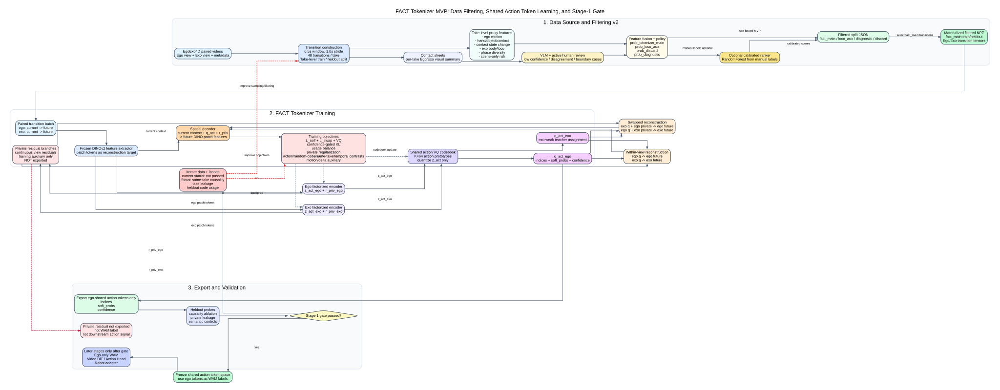
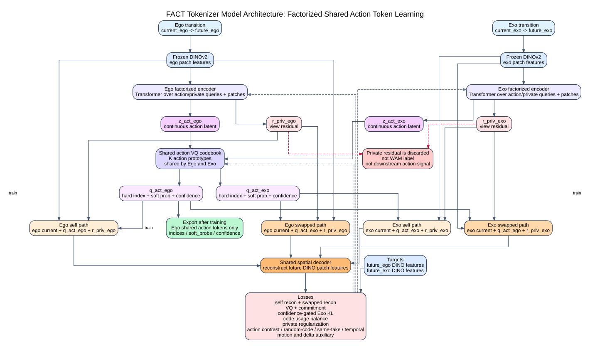

# FACT Tokenizer 阶段汇报文档

日期：2026-07-06  
项目范围：FACT Tokenizer MVP，一阶段 tokenizer 研究与工程实现  
汇报定位：面向阶段性组会 / 项目进展汇报，可直接拆分为 PPT 内容

---

## 1. 汇报摘要

本阶段工作的核心目标，是从配对的 Ego/Exo 人类视频 transition 中学习一种 **ego-accessible shared action token**。这个 token 希望表达跨视角一致的交互动作动态，例如接近、接触、稳定操作、释放、阶段变化等，而不是简单编码场景、物体外观、take identity、视角差异或背景信息。

当前仓库已经完成了 FACT tokenizer 一阶段 MVP 的主要工程闭环，并补充了面向 tokenizer 训练的数据筛选管线：

- 已支持 Ego/Exo paired NPZ 数据加载。
- 已接入 frozen DINOv2 patch feature 作为重建目标。
- 已实现 Ego/Exo 双 view encoder。
- 已实现共享 VQ action codebook。
- 已实现 private residual branch，用于 tokenizer 训练阶段吸收 view-specific residual。
- 已实现 self reconstruction 与 swapped reconstruction。
- 已实现 confidence-gated Exo prototype alignment、code usage balancing、private regularization、action contrast、random-code negative、same-take / temporal hard negative 等多轮实验机制。
- 已支持 DDP 多卡训练、checkpoint resume、token 导出、heldout probe、Stage-1 gate 评估和结果可视化。
- 已实现 filtering_v2 数据筛选流程，用 hand-object/contact、phase diversity、exo body/loco、主动复核和 ranker 校准筛出更适合 tokenizer 主训练的 takes。

但需要强调：**当前 tokenizer 还没有通过 Stage-1 gate，不能冻结为后续 WAM 或 Action Head 的 token label 生成器**。目前最有价值的成果不是“最终 tokenizer 已经完成”，而是已经跑通了一阶段系统，并定位出 shared action token 学习中的关键瓶颈：action causality、same-take action discrimination、take/context leakage 与 codebook health 之间存在明显冲突。

---

## 2. 研究背景与问题定义

### 2.1 为什么需要 FACT Tokenizer

后续 WAM、Video DiT 或 Action Head 如果直接从视频像素或连续特征学习动作语义，会遇到几个问题：

1. 第一视角视频包含大量非动作因素，例如相机运动、遮挡、手部外观、物体纹理、背景和光照。
2. 单纯 future feature prediction 容易学到视觉变化，而不是可迁移的交互动作变量。
3. Exo 视角能看到更完整的身体和物体交互，但部署时机器人通常只有 ego camera。
4. 后续模型需要的是部署时可由 ego observation 预测的动作 token，而不是训练时依赖 exo 的 latent。

因此，本项目提出一阶段 FACT tokenizer：利用训练时同步的 Ego/Exo 视频，把更清晰的 Exo 交互信息压缩进一个 **Ego 可访问的 shared action token space**，并最终只导出 ego branch 的 shared action token 给后续模型。

### 2.2 一阶段目标

一阶段不是做完整机器人控制，也不是训练 WAM 或 Action Head，而是学习并验证 shared action tokenizer：

- 输入：paired Ego/Exo video transition。
- 输出：ego branch 的 shared action token label。
- 训练辅助：Exo branch、private residual、swapped reconstruction、contrastive negatives 等。
- 最终导出：只导出 `indices`、`soft_probs`、`confidence`。
- 不导出：private residual latent。

目标 token 应满足：

- **Action-centric**：对未来交互动态有因果作用。
- **View-invariant**：不显著编码 ego/exo 视角身份。
- **Low take leakage**：不显著编码 take、场景或背景 identity。
- **Ego-predictable**：后续可以被 ego-only WAM 预测。
- **Codebook healthy**：使用足够多但不过度碎片化的 shared action prototype。

---

## 3. 总体模型架构

汇报时可以先用下面这张总流程图建立全局视角，再展开模型内部细节：



如果只讲 tokenizer 模型本身，可以使用下面这张更聚焦的内部架构图：



### 3.1 输入与数据形式

当前 MVP 使用两帧 transition：

```text
current frame -> future frame
```

每个样本包含两个同步视角：

```text
ego: (current_ego, future_ego)
exo: (current_exo, future_exo)
```

训练时每个 view 的视频先经过 frozen DINOv2 patch feature extractor：

```text
video frames -> DINOv2 patch tokens
```

当前主线默认设置：

- 输入分辨率：224 x 224。
- backbone：frozen DINOv2 ViT-B/14 register model。
- DINO patch dim：768。
- patch size：14。
- 每帧 patch tokens：约 16 x 16 = 256 个 patch tokens。

DINOv2 backbone 不参与训练，只作为稳定的视觉特征空间和 reconstruction target。

### 3.2 双视角 factorized encoder

模型包含两个独立 view encoder：

- Ego encoder。
- Exo encoder。

每个 encoder 接收对应视角的 DINO patch tokens，并输出两类 latent：

```text
z_act   : shared action latent
r_priv  : private residual latent
```

其中：

- `z_act` 进入共享 action VQ codebook。
- `r_priv` 不进入 VQ，不离散化，只是连续 residual。
- Ego/Exo 的 `z_act` 使用同一个 shared VQ codebook。
- Ego/Exo 的 private residual 只服务各自视角的重建，不参与跨视角对齐，也不导出。

这种设计的动机是：如果不显式分离 private residual，shared token 会被迫同时承担动作、外观、遮挡、相机运动和背景重建压力，最终很难成为干净的 action token。

### 3.3 Shared action VQ codebook

Ego 和 Exo branch 的 action latent 共享同一个 VQ codebook：

```text
z_act_ego -> shared VQ codebook -> q_act_ego
z_act_exo -> shared VQ codebook -> q_act_exo
```

当前主线通常使用：

- codebook size：K = 64。
- action slots：4。
- latent dim：32。
- private slots：1。
- private dim：4 或 8，后续增强实验中多使用更小 private dim 以限制 private shortcut。

VQ 模块输出：

- hard token indices。
- quantized embedding `z_q`。
- soft assignment distribution `soft_probs`。
- entropy-derived confidence。
- codebook / commitment loss。

### 3.4 Decoder 与 future reconstruction

Decoder 接收三类信息：

```text
current patch context
shared action token
private residual
```

输出 future frame 的 DINO patch feature reconstruction。

基础 self reconstruction 路径：

```text
ego current + q_act_ego + r_priv_ego -> ego future
exo current + q_act_exo + r_priv_exo -> exo future
```

核心 swapped reconstruction 路径：

```text
ego current + q_act_exo + r_priv_ego -> ego future
exo current + q_act_ego + r_priv_exo -> exo future
```

swapped reconstruction 是本项目的核心约束：如果 shared action token 真正表达跨视角一致的交互动作，那么 Exo-derived action token 应能替换 Ego-derived action token 来帮助重建 Ego future；反向也一样。

### 3.5 Private residual 的角色

Private residual 是训练辅助，不是后续动作标签。

它应该负责解释：

- ego/exo 视角各自的外观残差。
- 遮挡和局部视觉变化。
- 相机运动造成的 view-specific feature difference。
- 不应迁移到 robot action label 的视觉信息。

它不应该负责主要动作信息。为避免 private residual 变成 shortcut，实验中使用：

- private dimension bottleneck。
- private dropout。
- private L2 regularization。
- no-private reconstruction / contrast。
- private leakage probe。

---

## 4. 训练目标与 Loss 设计

### 4.1 Reconstruction loss

基础重建损失在 DINO feature 空间计算 MSE：

```text
L_self = ego_self_mse + exo_self_mse
L_swap = ego_swap_mse + exo_swap_mse
```

训练早期更依赖 self reconstruction 稳定 encoder、decoder 和 VQ codebook；中后期提高 swapped reconstruction 权重，让模型更关注跨视角 shared token。

默认调度：

- 前 20% steps：`self=1.0`，`swap` 从 0 逐渐升到 0.5。
- 20% steps 后：`self=0.2`，`swap=1.0`。
- KL alignment 从 10% steps 后开启，最终权重约 0.1。

### 4.2 VQ loss

VQ loss 包含：

- codebook loss。
- commitment loss。

形式上保持 standard VQ-VAE 逻辑：

```text
L_vq = ||sg[z_act] - code||^2 + beta * ||z_act - sg[code]||^2
```

其中 `beta` 在不同实验中调整，v6b 使用较强 commitment 约束，例如 `vq_beta=0.40`。

### 4.3 Confidence-gated Exo prototype alignment

Exo 视角通常能看到更完整的身体和物体交互，因此使用 Exo assignment 作为 weak teacher，对 Ego assignment 做 KL alignment：

```text
KL( stopgrad(p_exo) || p_ego )
```

该项使用 Exo confidence gating：

- Exo assignment 越确定，对 Ego 的 teacher 权重越高。
- Exo assignment 不确定时，降低对 Ego 的牵引。
- 后续实验加入 ego uncertainty 与 ego/exo disagreement 的 corrective gate。

注意：这个对齐只发生在 shared action prototype 层面，不对齐 private residual。

### 4.4 Codebook usage balancing

为了避免 code collapse，当前实现包含多类 code usage 正则：

- soft assignment balance。
- hard usage balance。
- hard usage entropy。
- slot balance。
- slot diversity。
- usage capacity。
- motion-gated usage。

但实验表明，usage 正则必须非常谨慎。单纯强行打开 codebook 容易把 take、view、context 信息摊入更多 code，导致 leakage 反弹。

### 4.5 Action causality contrast

为了确认 shared action token 对 future reconstruction 真正有因果作用，后续实验加入多种 negative control 路径：

- global shuffle action。
- random-take action。
- same-take shuffle action。
- temporal-offset action。
- random-code action。
- zero-action。
- action-aware hard negative。

训练目标希望：

```text
correct action reconstruction loss < corrupted action reconstruction loss
```

其中 v5p 之后最明确的正向机制是 explicit random-code negative，它首次让 `ego_swap_random_code_delta` 通过 Stage-1 gate 阈值。

### 4.6 Motion / Delta focused objectives

后续 v6 系列尝试让 token 更关注变化而非静态重建：

- motion focus。
- delta focus。
- action-only delta focus。
- delta contrast。
- delta direction / magnitude weighting。

结果显示：

- v6a 的 bottleneck current context + strong delta 是明显负结果。
- v6b 的 full current context + mild delta 更稳定，并提升了 action-without-private saving。

---

## 5. 实验设置

### 5.1 数据来源

当前主线使用 EgoExo4D paired Ego/Exo 视频数据。

早期数据：

- 500 diverse takes。
- 约 16 transitions/take。
- 总 transition：7999。
- train takes：400。
- heldout takes：100。
- train transitions：6399。
- heldout transitions：1600。
- split 按 take 划分，而不是随机按 transition 划分。

后续主线 transition48 数据：

- transition window：0.5s。
- stride：1.0s。
- 每个可用 take 严格采样 48 个 transition。
- 跳过 73 个短 take，不做重复 clamp。
- full shard：427 takes / 20496 transitions。
- train：342 takes / 16416 transitions。
- heldout：85 takes / 4080 transitions。
- train / heldout 继续按 take 划分。

transition48 的价值在于：同一个 take 内覆盖更多不同时间点和动作阶段，降低模型把 token 退化为 take identity 的风险。

### 5.2 数据筛选 filtering_v2

在 transition48 之后，仓库进一步补充了 `filtering_v2` 数据筛选线。它的定位不是替代 tokenizer 训练，而是在训练前把已有 FACT-style split 进一步筛成更适合第一阶段 shared action tokenizer 的数据资产。

筛选目标与 tokenizer 的失败项直接相关：

- 提高 `fact_main` 中 hand-object/contact 和 interaction-rich transition 的比例。
- 保留同一 take 内足够 phase diversity，服务 same-take / temporal action discrimination。
- 降低 scene-only、纯背景、低动作、低接触样本进入主训练的概率。
- 将 whole-body locomotion 类样本放入 capped `loco_aux`，作为可控 ablation，而不是混入主训练。
- 将 ambiguous、fine-dexterous 或信号冲突样本放入 `diagnostic_candidate`，用于诊断而不是直接训练。

当前代码实现的是“多信号预筛选 + 主动复核 + ranker 校准 + split/NPZ materialization”的闭环。

第一步是生成人工和 VLM 都容易查看的 contact sheet：

```text
tools/make_take_contact_sheets.py
```

它按 take 汇总 Ego/Exo transition 画面，并输出 `contact_sheet_manifest.csv`，后续每个 take 的自动评分、人工复核和 VLM 判断都可以引用同一张 contact sheet。

第二步是提取轻量 take-level proxy features：

```text
tools/extract_relevance_features.py
tools/extract_ego_hand_object_features.py
tools/extract_exo_pose_phase_features.py
```

这些脚本当前只依赖 NPZ 内已有帧，不需要额外 detector，因此适合快速跑通 MVP。它们输出的核心特征包括：

- `ego_motion_score`：ego 视角 transition motion。
- `exo_body_motion_score` / `exo_body_motion_score_v2`：exo 全身或大范围运动 proxy。
- `object_motion_proxy`：ego 中央区域物体/手部运动 proxy。
- `temporal_diversity_score`：同 take 内 transition 差异。
- `ego_hand_score` / `ego_hand_visibility_prob`：ego hand visibility proxy。
- `object_presence_score` / `object_motion_score`：物体存在和运动 proxy。
- `hand_object_contact_score`：由 hand、object motion、object presence 融合得到的接触 proxy。
- `contact_state_change_score`：接触状态变化 proxy。
- `exo_body_visibility_score` / `exo_pose_confidence`：exo body visibility proxy。
- `body_phase_diversity_score` / `pose_state_change_score`：exo pose/phase diversity proxy。

第三步是融合多信号并自动打 bucket：

```text
tools/merge_relevance_features.py
configs/filter_policy_v2.yaml
```

融合逻辑不是单一阈值，而是先估计四类 suitability score：

```text
prob_tokenizer_main
prob_loco_aux
prob_discard
prob_diagnostic_candidate
```

其中 `prob_tokenizer_main` 主要由 interaction、hand-object contact、interacting object、phase diversity 和非 scene-only 信号组成；`prob_loco_aux` 主要由 locomotion prior、exo body visibility、loco motion 和 body phase diversity 组成；`prob_discard` 关注 scene-only、低 contact/body、低 phase；`prob_diagnostic_candidate` 关注 fine dexterous 和多信号冲突。

`filter_policy_v2.yaml` 中当前主阈值为：

| bucket | 关键条件 |
|---|---|
| `fact_main` | `prob_tokenizer_main >= 0.60`，`hand_object_contact_score >= 0.35`，`phase_diversity_score_v2 >= 0.18`，`scene_only_score <= 0.42` |
| `loco_aux` | `prob_loco_aux >= 0.58`，`exo_body_visibility_score >= 0.35`，`body_phase_diversity_score >= 0.18`，`scene_only_score <= 0.55` |
| `diagnostic_candidate` | `prob_diagnostic_candidate >= 0.52`，或 fine dexterous / high disagreement |
| `discard` | 不满足主训练或辅助训练条件，或 scene/discard 信号过强 |

第四步是主动复核和 ranker 校准：

```text
tools/export_active_review_csv.py
tools/validate_annotations.py
tools/train_relevance_ranker.py
tools/apply_relevance_ranker.py
```

自动筛选不会盲信规则。低置信度、信号冲突、靠近阈值、疑似 false drop、或 fact_main 但 contact 证据不足的样本会被标记为 `needs_human_review=1`，再导出主动复核 CSV。人工只需要填写：

```text
take_relevance
ego_hand_visibility
exo_body_visibility
object_interaction
phase_diversity
usable_for
notes
```

人工校准后，可以训练轻量 RandomForest ranker，并把 ranker 输出重新写回 relevance CSV。这样后续可以从纯规则策略平滑过渡到人工校准后的数据选择策略。

第五步是生成 filtered split 和可训练 NPZ：

```text
tools/build_filtered_split.py
tools/build_transition_selection.py
tools/build_filtered_npz.py
tools/audit_filtered_split.py
```

`build_filtered_split.py` 会按 take 保持 train/heldout split，并输出：

```text
filtered_split_v2.json
```

`build_transition_selection.py` 再在每个保留 take 内选 transition。默认 `fact_main` 选 48 个 transition；`loco_aux` 可 capped 到 12 个 transition。选择方式支持：

- temporal coverage：不加载视频，按时间均匀覆盖。
- motion-aware temporal coverage：在时间 bin 内选择 motion 更明显的 transition。

最后 `build_filtered_npz.py` materialize 出新的 `train_by_take.npz` 和 `heldout_by_take.npz`。

当前本地已有一套真实最小筛选结果：

```text
outputs/filtering_v2_minimal_real/
```

该结果的 audit 统计为：

| split | fact_main | diagnostic_candidate | discard | loco_aux |
|---|---:|---:|---:|---:|
| train | 308 takes | 5 takes | 29 takes | 0 takes |
| heldout | 71 takes | 2 takes | 12 takes | 0 takes |

对应产物包括：

- `take_relevance_scores_v2_all.csv`：428 行，其中 1 行是表头，对应 427 个可用 takes。
- `annotation_batch_v2_review.csv`：166 行，其中 1 行是表头，对应 165 个主动复核样本。
- `selected_takes_filtering_v2_fact_main.jsonl`：379 个 fact_main takes。
- `transition_selection_fact_main_train.csv`：14784 个 train selected transitions，CSV 另有表头。
- `transition_selection_fact_main_heldout.csv`：3408 个 heldout selected transitions，CSV 另有表头。
- `filtered_npz/fact_main/train_by_take.npz`：已 materialize，train ego/exo shape 为 `(14784, 2, 224, 224, 3)`。
- `filtered_npz/fact_main/heldout_by_take.npz`：已 materialize，heldout ego 至少确认 shape 为 `(3408, 2, 224, 224, 3)`。

因此，数据筛选线当前已经具备实际训练接入条件。它和前面 transition48 主线的关系是：transition48 解决“每个 take 内覆盖更多动作阶段”的问题；filtering_v2 进一步解决“哪些 take 值得进入 tokenizer 主训练”的问题。

### 5.3 训练资源与配置

典型主线训练使用：

- 4-GPU 或 8-GPU DDP。
- per-GPU batch：16 或 32。
- global batch：约 128 或 256。
- optimizer / scheduler 由训练脚本统一管理。
- backbone frozen，训练 encoder、VQ、decoder 等 tokenizer 参数。
- 支持 checkpoint resume。

v6b 代表性配置：

- 起点：v5p t0.5 final checkpoint。
- 数据：transition48 train split。
- GPU：8。
- steps：从约 84k 继续到 90k。
- model dim：128。
- DINO dim：768。
- latent dim：32。
- private dim：4。
- codebook：64 codes。
- action slots：4。
- private slots：1。
- current context：full。
- VQ temperature：0.050。
- VQ beta：0.40。
- private dropout：0.60。
- exo auxiliary multiplier：3.5。
- 使用 random-code、zero-action、same-take、temporal-offset、no-private、mild delta/motion 等辅助目标。

### 5.4 验证设置

验证脚本包含三类输出：

1. `causality_ablation`
   - correct token vs random-take / same-take / random-code / temporal-offset / zero / random-code controls。
   - 观察 corrupted action 是否显著增加 future reconstruction error。

2. `private_leakage_ablation`
   - action token / private residual 的 3x3 ablation。
   - 检查模型是否主要依赖 private residual 或 current frame shortcut。

3. `semantic_probe`
   - view invariance。
   - take leakage。
   - token usage。
   - 可选 label purity / NMI / conditional histogram。

Stage-1 gate 使用 heldout takes 上的 probe 结果。

### 5.5 Stage-1 Gate 指标

当前 gate 目标如下：

| 指标 | 阈值 | 含义 |
|---|---:|---|
| `ego_swap_random_take_delta` | >= 0.015 | 换成其他 take 的 action 后，ego future 重建应明显变差 |
| `ego_swap_random_code_delta` | >= 0.025 | 换成随机 code 后，ego future 重建应明显变差 |
| `ego_swap_same_take_delta` | >= 0.010 | 同 take 不同 transition/action phase 应能区分 |
| `exo_swap_random_take_delta` | >= 0.002 | exo branch 也应有 action causality |
| `exo_swap_zero_delta` | >= 0.006 | exo branch 对 zero action 应敏感 |
| `ego_action_without_private_saving` | >= 0.018 | 去掉 private 后，correct action 仍应有贡献 |
| `ego_private_only_gap` | <= 0.012 | private-only 不能替代 action token |
| `tuple_view_nmi` | <= 0.10 | token 不应明显编码 view identity |
| `tuple_take_nmi` | <= 0.35 | token 不应明显编码 take identity |
| `ego_used_codes` | 45-55 | 64-code codebook 中 ego 侧应健康使用约 45-55 个 code |

这些指标共同约束 token 既要有 action 因果性，又要低泄漏，还要有健康 codebook usage。

---

## 6. 实验路线与当前成果

### 6.1 工程 smoke 阶段

早期 debug 实验主要验证工程链路：

- dummy multiview smoke。
- small paired NPZ。
- mock backbone。
- DINO backbone small run。
- 3 takes / 10 takes / 40 takes debug。
- 4-GPU DDP smoke。

结论：

- paired dataset、DINO feature path、shared codebook、private residual、DDP、checkpoint、token export 都已经跑通。
- 小数据 code usage 波动很大，不能证明 token 已 action-centric。
- 该阶段只证明工程闭环。

### 6.2 v0.1：500-take K64 主基线

代表 run：

```text
egoexo_diverse_500takes_k64_20k_ddp4_resumable_20260615_181053
```

结果：

- total loss 从约 1.53 降到约 0.70-0.73。
- self reconstruction 与 swap reconstruction 接近。
- ego token 成功导出，shape 为 `(7999, 1, 4)`。
- private residual 未导出。
- code usage：49/64。
- effective codes：17.7。

意义：

- 第一次完整证明 FACT tokenizer MVP 可以训练、保存、恢复、导出、验证。
- shared token 在 reconstruction path 中可替换。

不足：

- reconstruction 成功不等于 action semantics 成立。
- decoder 可能依赖 current frame、private residual 或 take/context shortcut。
- 当时缺少严格 heldout take gate。

### 6.3 v1-v4d：action bottleneck 与 usage 修复

v1 加入 private dropout、action-only/no-private reconstruction、shuffled contrast 等，增强 action bottleneck，但 code usage 从 v0.1 的 49/64 降到 27/64。

v2 加强 exo auxiliary、assignment entropy、motion focus 和 private dropout：

- confidence mean 提高到约 0.195。
- view leakage 明显下降。
- take NMI 从约 0.62 降到约 0.37-0.41。
- 但 code usage 只有 23/64。

v3/v3b 是负结果：过强 entropy / slot balance / delta 从高 usage v0.1 出发仍导致 hard code usage collapse。

v4/v4b/v4c 尝试 hard usage 修复，发现 hard usage loss 权重过强会造成 soft assignment 模糊和训练不稳定。

v4d 是早期最均衡模型：

- train code usage：46/64。
- effective codes：21.4。
- confidence mean：0.3458。
- ego random-take causality delta：约 0.0131。
- exo random-take causality delta：约 0.00089。

但 v4d 在正式 heldout gate 下仍失败：

- `ego_swap_random_take_delta = 0.01198 < 0.015`
- `ego_swap_random_code_delta = 0.02361 < 0.025`
- `exo_swap_random_take_delta = 0.00092 < 0.002`
- `tuple_view_nmi = 0.134 > 0.10`
- `tuple_take_nmi = 0.463 > 0.35`
- `ego_used_codes = 41 < 45`

结论：v4d 证明 codebook 可以打开，但 token 仍有 take/view leakage，action causality 也不足。

### 6.4 v5 系列：take split、4.0 weak teacher、transition48 与 hard negatives

v5a/v5b 跑通按 take split 的训练与 heldout gate 路径。scratch 训练不如从已有 checkpoint finetune 稳定。

v5c/v5d 加强 action bottleneck、slot dropout、private separation：

- `tuple_view_nmi` 被压到 gate 阈值内。
- 但 take leakage、action causality 和 code usage 仍失败。

v5f/v5g/v5j/v5k 按 4.0 非 multi-exo 方案推进：

- confidence-gated exo weak teacher。
- ego uncertainty / disagreement corrective teaching。
- private regularization。
- same-take contrast。
- take-grouped batch。
- take uniform / slot uniform / pair uniform anti-take losses。

代表结果：

| run | train code usage | take_nmi | view_nmi | ego_used | 结论 |
|---|---:|---:|---:|---:|---|
| v5f | 36/64 | 0.433 | 0.062 | 35 | view leakage 健康，但 take/usage/causality 失败 |
| v5g | 37/64 | 0.523 | 0.083 | 32 | take leakage 反弹 |
| v5j | 32/64 | 0.466 | 0.087 | 30 | usage 收缩 |
| v5k | 26/64 | 未正式 gate | - | - | train-side collapse 明显 |

结论：只在旧 16 transitions/take 数据上堆 anti-take 和 usage loss，不能解决核心问题。

### 6.5 v5l/v5m/v5n：transition48 数据策略

v5l 使用 dense transition48：

- `transition_sec=0.5s`
- `stride_sec=1.0s`
- 每 take 48 transitions
- train/heldout 按 take split

heldout gate：

| metric | value | threshold | pass |
|---|---:|---:|---|
| `tuple_view_nmi` | 0.055 | <= 0.10 | yes |
| `tuple_take_nmi` | 0.339 | <= 0.35 | yes |
| `ego_used_codes` | 21 | >= 45 | no |
| `ego_swap_random_take_delta` | 0.0039 | >= 0.015 | no |
| `ego_swap_random_code_delta` | 0.0034 | >= 0.025 | no |
| `exo_swap_zero_delta` | 0.0013 | >= 0.006 | no |
| `ego_action_without_private_saving` | 0.0070 | >= 0.018 | no |

核心结论：

- transition48 首次把 take leakage 压到阈值内。
- view leakage 继续健康。
- 但 action causality 全面偏弱。
- code usage 从 v5f 的 36/64 降到 23/64，heldout ego 只有 21 codes。

v5m/v5n 对照：

| metric | v5m | v5n | threshold |
|---|---:|---:|---:|
| `ego_swap_random_take_delta` | 0.0048 | 0.0043 | >= 0.015 |
| `ego_swap_random_code_delta` | 0.0066 | 0.0084 | >= 0.025 |
| `tuple_view_nmi` | 0.053 | 0.079 | <= 0.10 |
| `tuple_take_nmi` | 0.348 | 0.379 | <= 0.35 |
| `ego_used_codes` | 26 | 31 | >= 45 |

结论：

- transition48 能降低 take leakage。
- 但 dense transition 本身不能自动产生 action-causal token。
- 高 usage 起点可能提高 used codes，但会带来 take leakage 反弹。

### 6.6 v5o/v5p/v5q：zero-action、random-code 与 temporal hard negative

v5o 加强 zero-action / no-private action 约束：

- `exo_swap_zero_delta=0.0272` 通过阈值。
- `ego_action_without_private_saving=0.0171` 接近阈值。
- 但 random-code、take leakage、code usage 仍失败。

v5p 加入 explicit random-code negative，是重要正向节点：

| metric | v5p t0.5 | threshold | pass |
|---|---:|---:|---|
| `ego_swap_random_code_delta` | 0.0295 | >= 0.025 | yes |
| `exo_swap_random_take_delta` | 0.0021 | >= 0.002 | yes |
| `exo_swap_zero_delta` | 0.0179 | >= 0.006 | yes |
| `tuple_view_nmi` | 0.067 | <= 0.10 | yes |
| `tuple_take_nmi` | 0.396 | <= 0.35 | no |
| `ego_used_codes` | 23 | >= 45 | no |

结论：

- explicit random-code negative 首次让离散 action code 对 decoder 产生真实影响。
- 但模型只学会“任意随机 code 是错的”，还没有学会区分同 take 内不同动作阶段。

v5q 加入 temporal-offset hard negative 和 usage repair：

- random-code 能力基本保住：0.0286。
- same-take / temporal 指标只小幅改善。
- train used codes 从 26 到 33，但 effective codes 下降。
- take leakage 从 0.396 反弹到 0.410。
- cross-view alignment 变差。

结论：简单叠加 temporal hard negative 和 usage pressure 不能解决 same-take action semantics。

### 6.7 v5r/v6a/v6b/v6c：capacity、delta 与当前参考点

v5r 使用 action-aware contrast 与 usage capacity：

- heldout ego used codes 提高到 39。
- random-code 提高到 0.0338。
- 但 take_nmi 反弹到 0.509，view_nmi 反弹到 0.151。

结论：只修 usage 不够，打开的 code 很可能编码 take/view/context。

v6a 使用 bottleneck current context + strong delta：

- action causality 几乎全面崩掉。
- `ego_swap_random_code_delta` 从 v5p 的 0.0295 降到 0.0049。
- `tuple_take_nmi=0.605`，`tuple_view_nmi=0.204`。

结论：强 bottleneck + strong delta 是负结果，不适合作为后续起点。

v6b 使用 full current context + mild delta，是当前更健康参考点：

| metric | v6b | threshold | pass |
|---|---:|---:|---|
| `ego_swap_random_code_delta` | 0.0323 | >= 0.025 | yes |
| `exo_swap_zero_delta` | 0.0193 | >= 0.006 | yes |
| `ego_action_without_private_saving` | 0.0205 | >= 0.018 | yes |
| `ego_private_only_gap` | 0.0043 | <= 0.012 | yes |
| `tuple_view_nmi` | 0.056 | <= 0.10 | yes |
| `ego_swap_random_take_delta` | 0.0062 | >= 0.015 | no |
| `ego_swap_same_take_delta` | 0.0035 | >= 0.010 | no |
| `tuple_take_nmi` | 0.382 | <= 0.35 | no |
| `heldout ego_used_codes` | 27 | >= 45 | no |

意义：

- v6b 保住并增强 random-code 因果性。
- 首次明确通过 `ego_action_without_private_saving`。
- view-invariance 很健康。
- 但 same-take / random-take discrimination、take leakage 和 heldout usage 仍未解决。

v6c 从 v6b 加强 hard usage entropy：

- train used codes 从 v6b 的 37/64 收缩到 23/64。
- 尚缺正式 heldout gate。
- 不建议直接作为新主线。

---

## 7. 预期结果与当前实际结果对比

### 7.1 预期结果

理想情况下，一阶段 tokenizer 应达到：

1. Ego/Exo 同一 transition 的 action assignment 接近。
2. swapped reconstruction 接近 self reconstruction。
3. 替换 action token 后 reconstruction 明显变差。
4. 去掉 private residual 后，correct action token 仍能带来显著收益。
5. shared token 不显著预测 view identity。
6. shared token 不显著预测 take identity。
7. 64-code codebook 中 ego 侧使用约 45-55 个 code。
8. 导出的 ego token 可以作为后续 WAM label。

### 7.2 当前已经达到的结果

已经达到：

- 工程全链路跑通。
- DINO feature reconstruction 可训练。
- self/swap reconstruction 路径可运行。
- shared codebook 可训练。
- ego token 可导出。
- private residual 没有被导出。
- view leakage 在多个 run 中已经压到阈值内，v6b 为 0.056。
- random-code causality 已在 v5p/v5q/v5r/v6b 中稳定通过，v6b 为 0.0323。
- exo zero sensitivity 在 v5o/v5p/v5q/v5r/v6b 中通过，v6b 为 0.0193。
- v6b 首次让 ego action-without-private saving 通过，达到 0.0205。
- transition48 数据证明能显著降低 take leakage，v5l 达到 0.339。
- filtering_v2 数据筛选管线已跑出真实最小结果：379 个 fact_main takes、14784 个 train selected transitions、3408 个 heldout selected transitions，并已 materialize fact_main filtered NPZ。

### 7.3 当前尚未达到的结果

尚未达到：

- Stage-1 gate 未全部通过。
- heldout ego used codes 仍明显低于 45，v6b 为 27。
- same-take action discrimination 仍弱，v6b `ego_swap_same_take_delta=0.0035`。
- random-take action causality 仍弱，v6b `ego_swap_random_take_delta=0.0062`。
- take leakage 仍会在修 random-code / usage / delta 时反弹，v6b 为 0.382。
- exo random-take causality 仍偏弱。
- v6c 缺正式 heldout gate。

---

## 8. 关键发现

### 8.1 Reconstruction loss 不是充分指标

多个 run 中 reconstruction MSE 下降，但 action token 并不一定具有 action semantics。decoder 可能通过 current frame、private residual、take/context shortcut 完成重建。因此必须依赖 causality ablation 和 heldout gate。

### 8.2 View-invariance 已经相对可控

从 v5c 开始，大多数 run 的 `tuple_view_nmi` 低于 0.10。private separation、slot dropout、contrast 和 weak teacher 对降低 view leakage 是有效的。

### 8.3 Dense transition48 能降低 take leakage

v5l 首次将 `tuple_take_nmi` 降到 0.339，说明旧 16 transitions/take 数据确实容易让 token 学到 take identity。每 take 覆盖更多 transition 是正确方向。

### 8.4 Random-code negative 是明确正向机制

v5p 首次让 `ego_swap_random_code_delta` 通过阈值，v6b 继续保持。说明显式随机 code 负样本能让离散 code 对 decoder 产生真实影响。

### 8.5 Same-take action discrimination 是当前核心难点

模型已经能识别“完全随机 code 是错的”，但仍不能稳定区分同 take 内不同时间动作阶段。这是 shared action token 是否真正 action-centric 的关键瓶颈。

### 8.6 Code usage 与 leakage 存在冲突

v5r 打开 codebook 到 heldout ego 39 codes，但 take/view leakage 大幅反弹。说明“用更多 code”不等于“学到更多 action prototype”。健康 usage 必须和 anti-leakage / action-phase discrimination 同时成立。

### 8.7 Strong delta/bottleneck 可能破坏已有能力

v6a 证明强 bottleneck current context 与过强 delta objective 会破坏 random-code、zero-action 和 view/take invariance。v6b 的 full context + mild delta 更稳定。

### 8.8 数据筛选需要和 tokenizer gate 联动

filtering_v2 已经能按 hand-object/contact、phase diversity、exo body/loco 和 scene-only 风险筛出更适合 tokenizer 的 fact_main 数据。它直接针对当前失败项：same-take action discrimination 需要更丰富的同 take phase diversity，take leakage 需要减少低动作或场景主导样本，healthy usage 需要更多真实交互阶段而不是更多背景差异。

但 filtering_v2 仍不应只用自动标签准确率判断成功。最终标准仍然是训练后的 FACT tokenizer heldout probe：如果 filtered fact_main 能提高 same-take/random-take delta、降低 take leakage，并改善 heldout code usage，才说明数据筛选真正帮助了 shared action token 学习。

---

## 9. 当前阶段结论

当前 FACT tokenizer MVP 的结论可以概括为：

1. **工程层面已经完成一阶段闭环**：数据、模型、训练、导出、验证、可视化都已经可运行。
2. **数据侧已经补充 filtering_v2 筛选闭环**：当前能自动生成 take-level relevance scores、active-review CSV、filtered split、transition selection 和 filtered NPZ，为下一轮训练提供更干净的 fact_main 数据。
3. **研究层面已经验证多个关键机制**：swapped reconstruction、private separation、Exo weak teacher、transition48、random-code negative、heldout gate 等都提供了有价值信号。
4. **当前模型还不能冻结给 WAM**：Stage-1 gate 尚未通过，尤其是 same-take / random-take causality、take leakage 与 code usage。
5. **当前最健康参考点是 v6b / v5p，而不是 v6c**：v6b 局部通过最多 action-causality 子项，但仍未达最终标准；v6c 训练侧 usage 收缩且缺 heldout gate。
6. **下一步不应进入 WAM / Action Head**：否则下游会继承不稳定 token label，后续问题更难定位。

---

## 10. 下一步计划

### 10.1 立即补齐验证

第一优先级：

- 补跑 v6c heldout probe。
- 补跑 v6c Stage-1 gate。
- 与 v6b/v5p 横向比较。

如果 v6c gate 未明显改善，则不继续沿 v6c 强 usage entropy 方向推进。

### 10.2 重新设计 same-take / temporal hard negative

当前 same-take shuffle 与 temporal-offset 的提升有限。下一步应更精细选择 hard negative：

- 同一 take 内动作阶段差异更明显的 pairs。
- 基于 DINO delta / hand-object motion / contact proxy 选择 negative。
- 避免 negative 只是静态相近或动作相似片段。
- 将 temporal offset 从固定 offset 扩展为 action-aware offset。

### 10.3 同时约束 usage 与 anti-leakage

不建议单独提高 usage regularization。应同时观察：

- used codes。
- effective codes。
- max code fraction。
- take NMI。
- view NMI。
- same-take delta。

目标不是单纯增加 code 数量，而是让新增 code 对应动作阶段，而不是 take/context/view。

### 10.4 保持 transition48 主线

当前不建议回到旧 16 transitions/take split。主线继续使用：

```text
transition_sec = 0.5s
stride_sec = 1.0s
48 transitions/take
heldout split by take
```

`transition_sec=1.0s` 对照已显示 take leakage 更重，不作为主线。

### 10.5 接入 filtering_v2 fact_main 数据训练

建议新增一组数据侧对照，而不是只继续调 loss：

| run | 数据 | 起点 | 目的 |
|---|---|---|---|
| filtered-v6b-control | 原 transition48 split | v6b/v5p | 保持当前参考点，作为横向基线 |
| filtered-fact-main | filtering_v2 `fact_main` NPZ | v6b/v5p | 检查更高 hand-object/contact 与 phase diversity 是否提高 same-take/random-take causality |
| filtered-fact-main-plus-loco | 可选；若后续 policy/ranker 产生 `loco_aux`，使用 `fact_main + loco_aux` 且 loco capped 12/take | v6b/v5p | 检查少量 whole-body 运动辅助是否改善 exo branch，而不拉高 take leakage |

训练后必须继续跑同一套 heldout probe/gate。重点观察：

- `ego_swap_same_take_delta` 是否从约 0.0035 明显提高。
- `ego_swap_random_take_delta` 是否接近或超过 0.015。
- `tuple_take_nmi` 是否低于 0.35。
- `heldout ego_used_codes` 是否从 27 向 45 靠近。
- `ego_action_without_private_saving` 是否保持 v6b 的通过状态。

如果 filtering_v2 改善 action causality 但 code usage 仍低，再结合温和 usage/capacity；如果 code usage 提高但 take NMI 反弹，说明筛选仍需加强 anti-scene / anti-context 或 same-take phase 标注。

### 10.6 暂不扩展到后续模块

在 Stage-1 gate 全部通过前，不建议：

- 训练 WAM。
- 训练 Action Head。
- 导出 private residual 给下游。
- 加入完整 robot deployment。
- 把当前 tokenizer 作为稳定 label generator。

---

## 11. 可汇报的一页总结

本阶段我们完成了 FACT tokenizer 一阶段 MVP：利用 paired Ego/Exo transition 训练一个 factorized tokenizer，将跨视角共享的动作信息压入 shared VQ action codebook，同时用 private residual 吸收视角私有视觉残差。系统已经支持 DINOv2 feature reconstruction、Ego/Exo 双 encoder、shared action codebook、swapped reconstruction、Exo confidence-gated weak teacher、private separation、多卡训练、token 导出和 heldout gate 验证。同时，数据侧已经实现 filtering_v2 筛选闭环，能够基于 hand-object/contact、phase diversity、exo body/loco、主动复核和 ranker 校准生成 filtered split 与 filtered NPZ。

实验上，v0.1 证明工程闭环可行；v4d 证明 codebook 可以被打开；v5l 证明 dense transition48 能降低 take leakage；v5p 证明 explicit random-code negative 能让离散 action code 对 decoder 产生真实影响；v6b 在 random-code、exo zero、action-without-private 和 view-invariance 上取得当前最健康结果。数据筛选上，filtering_v2 已筛出 308 个 train fact_main takes 和 71 个 heldout fact_main takes，并 materialize 出 14784/3408 个 train/heldout selected transitions。但模型仍未通过 Stage-1 gate，主要失败在 same-take / random-take action discrimination、take leakage 反弹和 heldout code usage 偏低。因此当前 tokenizer 还不能冻结给后续 WAM，下一步应把 filtering_v2 fact_main 数据接入 v6b/v5p 参考训练，验证数据筛选是否真正改善 tokenizer gate。

---

## 12. 建议 PPT 结构

1. 项目目标：从 Ego/Exo 视频中学习 ego-accessible shared action token。
2. 核心挑战：future prediction 容易学到视觉 shortcut，而不是动作。
3. 模型架构：DINO backbone、Ego/Exo encoders、shared VQ codebook、private residual、decoder。
4. 关键训练机制：swapped reconstruction、Exo weak teacher、private separation、action causality contrast。
5. 数据设置：500 diverse takes、take-level split、transition48。
6. 数据筛选：filtering_v2 多信号预筛选、主动复核、ranker、filtered NPZ。
7. Stage-1 gate：action causality、view invariance、take leakage、usage、private leakage。
8. 实验路线：v0.1 -> v4d -> v5l -> v5p -> v6b。
9. 当前成果：工程闭环、transition48 有效、random-code 有效、v6b 局部通过多项 gate、filtering_v2 已产出 fact_main 数据。
10. 当前瓶颈：same-take discrimination、take leakage/code usage tradeoff、exo causality。
11. 下一步计划：v6c gate、filtering_v2 fact_main 对照训练、action-aware temporal negative、健康 usage + anti-leakage 联合优化。

---

## 13. 相关文件索引

- 研究计划：`docs/fact_tokenizer_plan_3_0.md`
- 中文 README：`README.zh-CN.md`
- 综合实验结论：`docs/fact_tokenizer_experiment_conclusions_20260618.md`
- 下一轮改进计划：`docs/fact_tokenizer_next_improvement_plan_20260618.md`
- 交付文档：`docs/fact_tokenizer_handoff_20260621.md`
- 总架构流程图：`docs/assets/fact_tokenizer_architecture/fact_tokenizer_full_pipeline.svg`
- 总架构流程图源文件：`docs/assets/fact_tokenizer_architecture/fact_tokenizer_full_pipeline.dot`
- 模型内部架构图：`docs/assets/fact_tokenizer_architecture/fact_tokenizer_model_architecture.svg`
- 模型内部架构图源文件：`docs/assets/fact_tokenizer_architecture/fact_tokenizer_model_architecture.dot`
- 数据筛选 workflow：`docs/filtering_v2_workflow.zh-CN.md`
- 数据筛选 policy：`configs/filter_policy_v2.yaml`
- filtering_v2 最小管线：`tools/run_filtering_v2_minimal.py`
- 数据筛选输出：`outputs/filtering_v2_minimal_real/`
- 模型实现：`fact_tokenizer/model.py`
- Loss 实现：`fact_tokenizer/losses.py`
- Stage-1 gate：`scripts/evaluate_fact_stage1_gate.py`
- v6b 训练脚本：`scripts/run_fact_transition48_v6b_delta_full_train.sh`
- 可视化目录：`docs/assets/fact_tokenizer_visualizations/`
